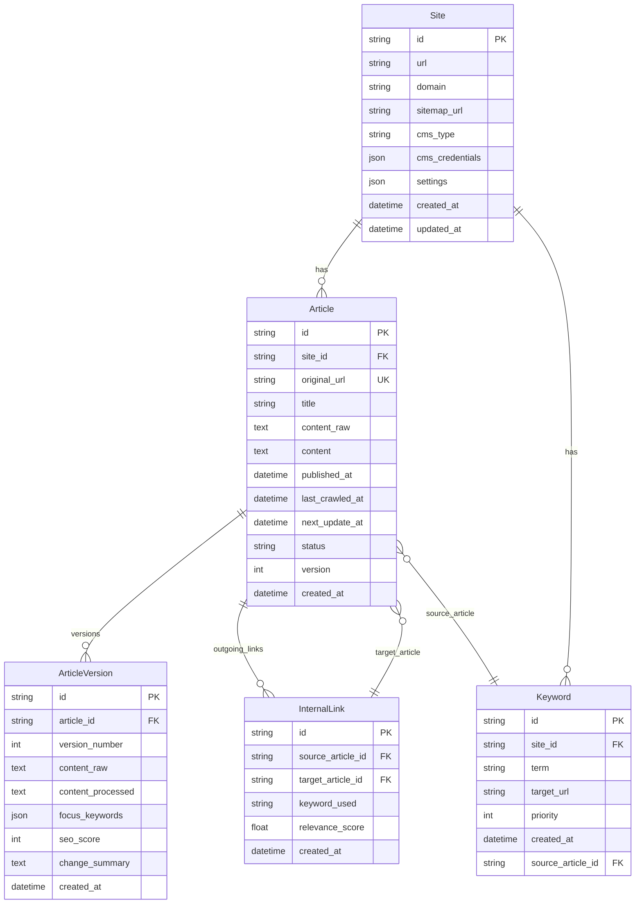

# SaaS SEO Platformu

## Genel Bakış

SaaS SEO Platformu, web siteleri için içerik pazarlaması ve arama motoru optimizasyonunu (SEO) dönüştürmek üzere tasarlanmış kapsamlı bir Yazılım-olarak-Hizmet çözümüdür. Platformumuz, blog içeriğinin keşfinden ve analizinden AI destekli güncellemelere ve yeniden yayınlamaya kadar tüm yaşam döngüsünü otomatikleştirir, içeriğinizin taze, ilgili ve arama motorları için optimize kalmasını sağlar.

## Temel Özellikler

### 🔍 Otomatik İçerik Keşfi
- **Web Sitesi Tarama**: Kullanıcı tarafından sağlanan web sitesi URL'lerinden otomatik olarak blog sayfalarını tarar ve keşfeder
- **Makale Çıkarma**: Makale başlıklarını, linklerini ve yayın tarihlerini çıkarır
- **Akıllı Tarih İşleme**: Yayın tarihleri mevcut olduğunda kullanır, yoksa tarama zamanını varsayılan olarak alır

### 🏷️ Akıllı Anahtar Kelime Yönetimi
- **Otomatik Anahtar Kelime Çıkarma**: Makale başlıklarından anahtar kelimeler üretir
- **İç Bağlantı**: Yeni makalelerde ilgili içeriği otomatik olarak bağlar
- **SEO Optimizasyonu**: Stratejik anahtar kelime entegrasyonu ile içerik keşfedilebilirliğini artırır

### 🤖 AI Destekli İçerik Güncellemeleri
- **Zamanlanmış Güncellemeler**: Yayınlandıktan sonra kullanıcı tanımlı aralıklarda (örn. 6 ay) içeriği otomatik yeniler
- **AI İçerik Geliştirme**: Gelişmiş AI kullanarak makale içeriğini günceller ve iyileştirir
- **Sorunsuz Yeniden Yayınlama**: Güncellenmiş içeriği otomatik olarak kullanıcının web sitesine geri yayınlar

### 📊 Veritabanı Tabanlı Mimari
- **Güçlü Veri Depolama**: Makaleleri, anahtar kelimeleri ve meta verileri güvenli bir şekilde saklar
- **Gerçek Zamanlı Senkronizasyon**: Yerel ve uzak içeriği senkronize tutar
- **Ölçeklenebilir Altyapı**: Yüksek performans için NestJS backend ile oluşturulmuştur

### 🎨 Kullanıcı Dostu Panel
- **Sezgisel Arayüz**: Modern, duyarlı deneyim için Next.js ile oluşturulmuştur
- **Kolay URL Yönetimi**: İşlemi başlatmak için basit web sitesi URL girişi
- **İlerleme Takibi**: Tarama, işleme ve güncelleme durumunu izler

## Teknoloji Yığını

- **Backend**: NestJS (Node.js framework) ile TypeScript
- **Frontend**: Next.js ile React ve TypeScript
- **Veritabanı**: Yapılandırılabilir veritabanı desteği ile TypeORM
- **AI Entegrasyonu**: İçerik üretimi ve güncellemeleri için gelişmiş dil modelleri
- **Dağıtım**: Konteyner hazır mimari

## Başlangıç

### Ön Koşullar
- Node.js (v18 veya üzeri)
- npm veya yarn
- Git

### Kurulum

1. **Repository'yi klonlayın**
   ```bash
   git clone https://github.com/silaakyz/saas_seo_platform.git
   cd saas_seo_platform
   ```

2. **Core backend için bağımlılıkları yükleyin**
   ```bash
   cd core
   npm install
   ```

3. **Panel frontend için bağımlılıkları yükleyin**
   ```bash
   cd ../panel
   npm install
   ```

4. **Çevre değişkenlerini yapılandırın**
   - `core/` ve `panel/` dizinlerinde `.env.example` dosyasını `.env` olarak kopyalayın
   - Veritabanı ve API yapılandırmalarını güncelleyin

5. **Geliştirme sunucularını başlatın**
   ```bash
   # Backend (core/ dizininden)
   npm run start:dev

   # Frontend (panel/ dizininden)
   npm run dev
   ```

### Kullanım

1. Panele `http://localhost:3000` adresinden erişin
2. Metin kutusuna web sitesi URL'nizi girin
3. Sistem otomatik olarak:
   - Blog makalelerini tarar ve keşfeder
   - Makale meta verilerini çıkarır ve saklar
   - İç bağlantı için anahtar kelimeler üretir
4. İçerik yenileme için otomatik güncelleme zamanlamaları ayarlayın

## API Dokümantasyonu

Backend aşağıdaki için RESTful API'ler sağlar:
- Makale yönetimi
- Anahtar kelime çıkarma ve bağlantı
- Tarama işlemleri
- AI içerik üretimi

Backend çalışırken API dokümantasyonu `/api/docs` adresinde mevcuttur.

## Veritabanı Şeması (ER Diyagramı)



